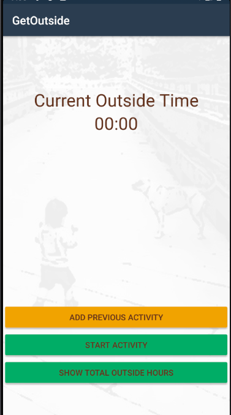

# GetOutside
App to track outside activity hours and set goals

## Table of contents
* [General info](#general-info)
* [Screenshots](#screenshots)
* [Technologies](#technologies)
* [Setup](#setup)
* [Features](#features)
* [Status](#status)
* [Build Instructions](#Build)
* [Inspiration](#inspiration)
* [Contact](#contact)

## General info
I created this app to help track my daughters outside hours. It was inspired by the [1000 Hours Outside](https://www.1000hoursoutside.com/) project.

## Screenshots

## Technologies
* .Net Standard Library - version 2.0.3
* sqlite-net-pcl - version 1.7.335
* Xamarin.Android.Support.Core.utils - version 28.0.0.3
* Xamarin.Android.Support.CustomTabs - version 28.0.0.3
* Xamarin.Android.Support.Design - version 28.0.0.3
* Xamarin.Essentials - version 1.6.0
* Xamarin.Forms - version 5.0.0.1874

## Setup
Install the app from [Play Store](https://play.google.com/store/apps/details?id=com.companyname.GetOutside)

## Features
List of features ready and TODOs for future development
* Start a timer to track activity hours
* Add previous activity hours
* view activity hours breakdown by month, day, and specific activities

To-do list:
* Add app to Apple store
* Add suggested activities
* view sum of hours by month and running total

## Status
Project is: _in progress_

## Build Instructions
* Pre-requisites:
** Android SDKs and tools API Level Versions: 21 - 30
** Android SDK Biuld Tools: version 30.0.3
** Android SDK Platform-Tools
** Visual Studio 2019

# Download the latest version of code from GitHub
# Build the solution

## Inspiration
Add here credits. Project inspired by [1000 Hours Outside](https://www.1000hoursoutside.com/).

## Contact
Created by @mehinc
